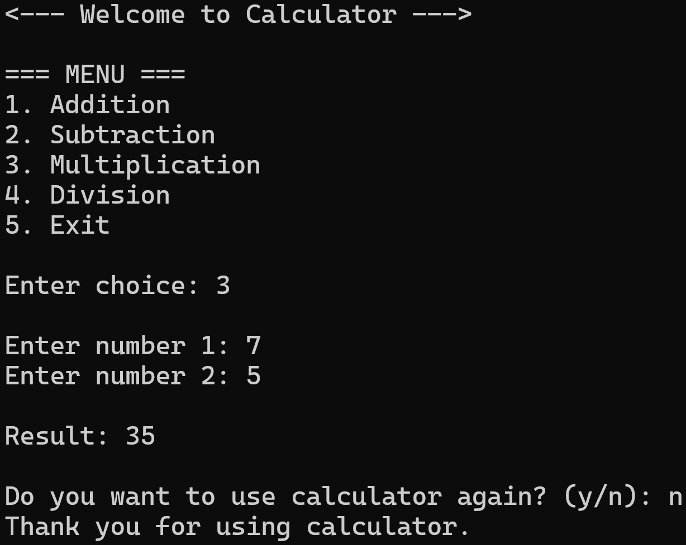

# 🧮 Simple Calculator in C++

A simple **console-based calculator** built in **C++** that performs basic arithmetic operations using functions. This project is ideal for beginners who are learning C++ fundamentals such as functions, loops, conditional statements, and user input.

---

## ✨ Features

* ➕ Addition
* ➖ Subtraction
* ✖️ Multiplication
* ➗ Division
* ✅ Division by zero handling
* 🔄 Repeat calculations without restarting the program
* 🚪 Exit option from the menu

---

## 📋 Menu

```text
=== MENU ===
1. Addition
2. Subtraction
3. Multiplication
4. Division
5. Exit
```

---

## 🛠️ Technologies Used

* **Language:** C++
* **Compiler:** g++, MinGW, MSVC, or any standard C++ compiler
* **IDE:** Visual Studio Code / Code::Blocks / Dev-C++ / Visual Studio

---

## ▶️ How to Run

1. Clone the repository:

```bash
git clone https://github.com/your-username/your-repository.git
```

2. Navigate to the project folder:

```bash
cd your-repository
```

3. Compile the program:

```bash
g++ calculator.cpp -o calculator
```

4. Run the executable:

**Windows**

```bash
calculator.exe
```

**Linux/macOS**

```bash
./calculator
```

---

## 📸 Sample Output


---

## 🎯 Learning Objectives

This project demonstrates:

* Functions
* Conditional statements (`if-else`)
* Loops (`while`)
* User input and output
* Basic arithmetic operations
* Simple program structure in C++

---

## 🚀 Future Improvements

* Add modulus (%) operation
* Add power and square root functions
* Implement scientific calculator features
* Improve input validation
* Create a graphical user interface (GUI)

---

## 📜 License

This project is open-source and available under the **MIT License**.

---

## 👨‍💻 Author

**Abdul Majid Qazi**

If you found this project helpful, consider giving it a ⭐ on GitHub!
